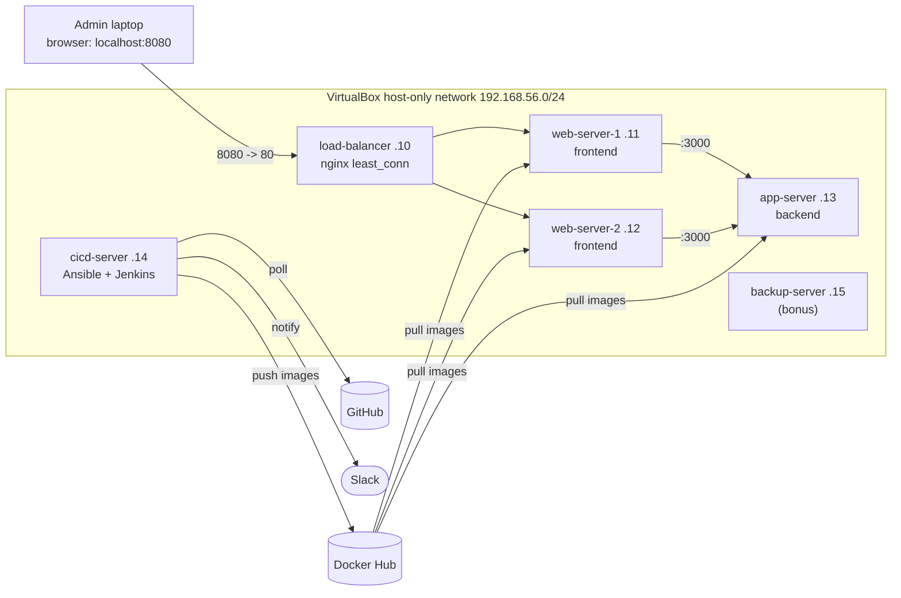
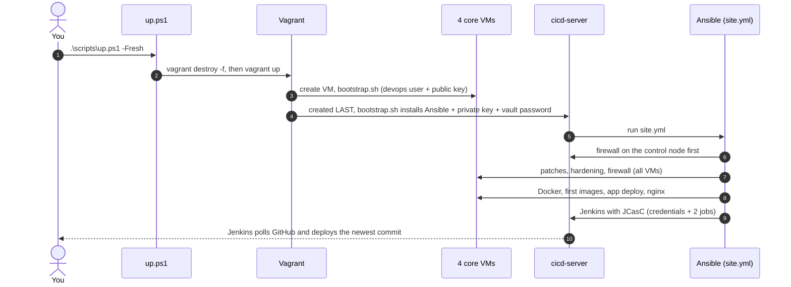
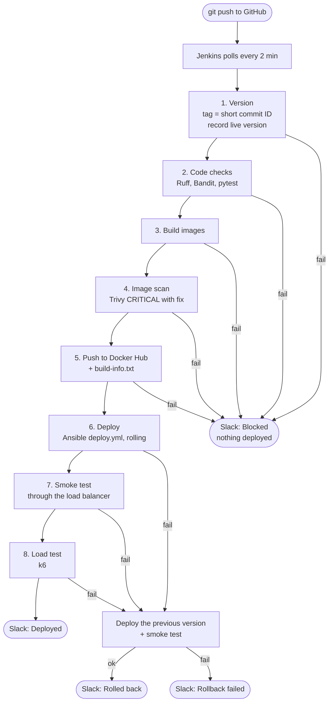
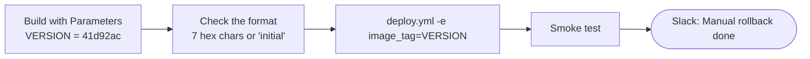
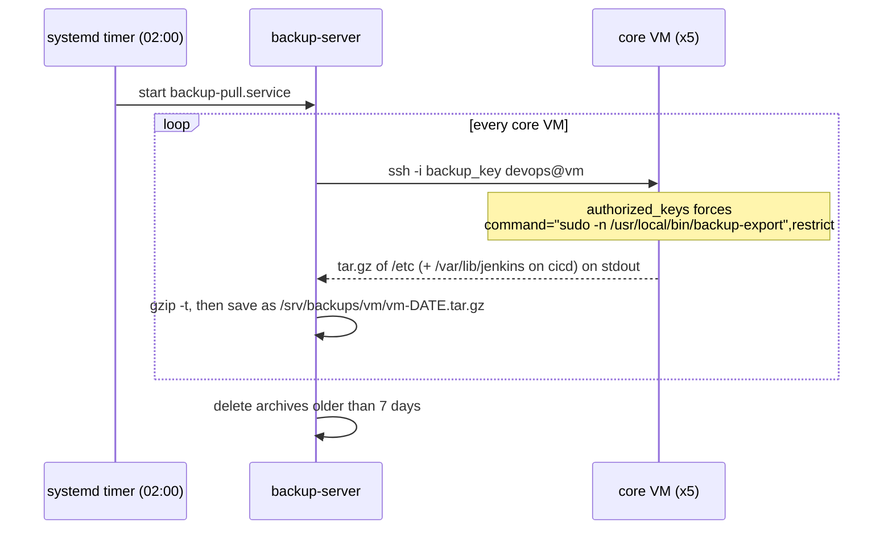

# Architecture — Automation Alchemy

How the pieces fit together. GitHub and Gitea render the Mermaid diagrams directly.

## 1. VMs and network

Not drawn, to keep the picture readable: **SSH** (port 22). The laptop and cicd-server
(Ansible) can SSH into every VM. In bonus mode, backup-server can SSH into every core VM,
but only to run the backup export (section 5).

**Traffic rules (UFW, deny by default):**

| To | Port | Allowed from |
|---|---|---|
| every VM | 22 | admin laptop, cicd-server (+ backup-server in bonus mode) |
| load-balancer | 80 | anyone (the public entry point) |
| web servers | 80 | load-balancer only |
| app-server | 3000 | web servers only |
| cicd-server | 8080 | admin laptop only |

The containers run with `network_mode: host`. With published ports, Docker writes its
own iptables rules and **bypasses UFW**; host networking keeps UFW in charge.

## 2. How the infrastructure is built

**One source of truth.** `ansible/inventory/hosts.yml` lists every VM with its IP, RAM
and CPUs. The Vagrantfile reads the same file, so an IP is never written twice.
The nginx upstream list, the firewall rules and `/etc/hosts` are generated from it too.

**Order matters.**
- cicd-server is created last because it configures all the others.
- Its own firewall goes up **before** Ansible connects anywhere. Turning UFW on later
  dropped Ansible's open connections and froze the run (see the notes, incident 2).
- The app is deployed **before** the load balancer, so nginx never points at empty servers.

## 3. Ansible roles

| Role | Runs on | Does |
|---|---|---|
| `common` | all | security patches (+ reboot if a new kernel needs it), base packages, hostname, `/etc/hosts`, timezone |
| `hardening` | all | devops password + sudo, removes bootstrap sudo, locks default accounts, SSH policy, umask 0027, unattended-upgrades |
| `firewall` | all | UFW deny-by-default + only the ports in section 1 |
| `docker` | web, app, cicd | Docker Engine from Docker's signed apt repo, log size limit |
| `image_build` | cicd | builds and pushes the `initial` images (only if missing) |
| `app_deploy` | web, app | runs one container, waits for `/health` |
| `loadbalancer` | lb | nginx config generated from the inventory, syntax check before reload |
| `jenkins` | cicd | Java 21, Jenkins LTS, plugins, JCasC, secrets, self-check of the jobs |
| `fail2ban` | all (bonus) | SSH jail, bans through UFW |
| `backup_server` | backup (bonus) | backup key, `backup-pull` script, systemd service + daily timer |
| `backup_source` | core (bonus) | `backup-export` script, sudo rule for it, locked authorized key |

`deploy.yml` (used by Jenkins and the rollback job) runs only `app_deploy`:
backend first, then the web servers with `serial: 1`.

## 4. The CI/CD pipeline

**Versioning.** Every image is tagged with the 7-character commit ID, so any running
container traces back to exactly one commit. The frontend shows the version on the page
and on `/health`. Rollback reads the live version from `/health` **before** deploying.

**Rolling deploy.** `serial: 1` updates one web server at a time and waits for its
health check. Meanwhile nginx sends users to the other server, so there is no downtime.

**Manual rollback** (`automation-alchemy-rollback` job):

**Jenkins as code.** Nothing is configured by clicking. Ansible writes `casc.yaml`
(admin user, permissions, credentials, both jobs as Job DSL). Secrets come from the
vault and are written to files only Jenkins can read. JCasC reads them with
`${readFile:...}`, so they never appear in `casc.yaml`.

## 5. Backups (bonus)

**Why pull, not push:** only the backup server holds a key. A hacked web server
cannot read, change or delete any backup. The key it accepts can do exactly one
thing: run `backup-export`. It gets no shell, no port forwarding and no terminal.

Password hashes (`/etc/shadow`) and private SSH host keys are excluded from the archives.
